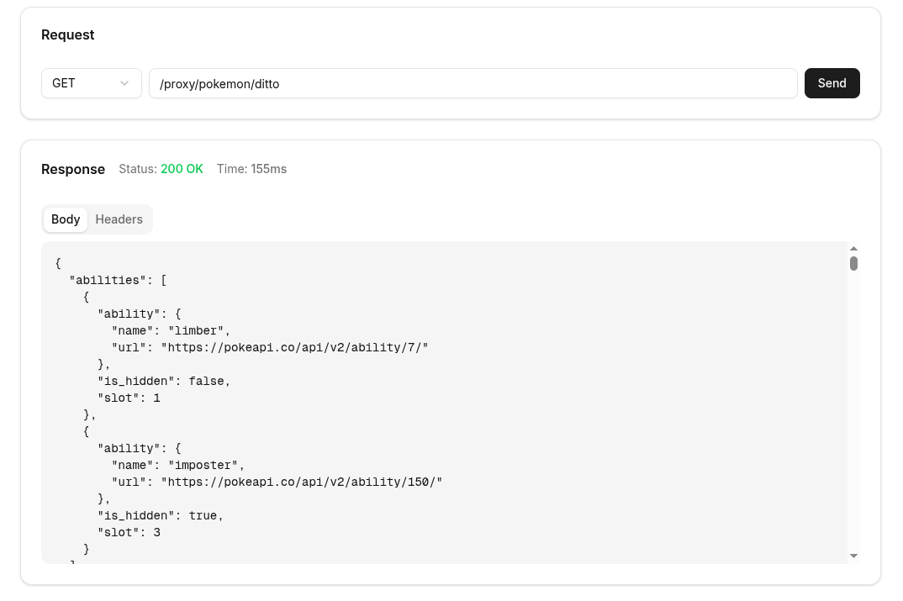

# Next.js Proxy Example

A demonstration of how to use Next.js API routes or middleware to proxy requests to external endpoints.

## Demo



## What This Demonstrates

This project shows two approaches to create a proxy in Next.js that forwards requests to an external API. This pattern is useful for:

- Avoiding CORS issues when calling external APIs from the browser
- Hiding API keys or sensitive credentials from the client
- Adding authentication or custom headers to requests
- Rate limiting or caching external API responses

## Two Approaches

| Approach      | Path           | File                                  |
| ------------- | -------------- | ------------------------------------- |
| Route Handler | `/api/proxy/*` | `src/app/api/proxy/[...all]/route.ts` |
| Middleware    | `/proxy/*`     | `src/proxy.ts`                        |

Both approaches use a shared proxy function in `src/app/lib/proxy.ts`.

---

## Approach 1: Route Handler

Use Next.js API routes with a catch-all segment to handle proxy requests.

### `src/app/api/proxy/[...all]/route.ts`

```typescript
import { proxyRequest } from "@/app/lib/proxy";
import { NextRequest } from "next/server";

export async function GET(request: NextRequest) {
  return proxyRequest(request, "/api/proxy");
}

export async function POST(request: NextRequest) {
  return proxyRequest(request, "/api/proxy");
}

// Add other HTTP methods as needed (PUT, PATCH, DELETE)
```

### Usage

```
/api/proxy/pokemon/pikachu  →  https://pokeapi.co/api/v2/pokemon/pikachu
```

---

## Approach 2: Middleware

Use Next.js middleware to intercept requests and proxy them before they reach route handlers.

### `src/proxy.ts`

```typescript
import { NextRequest, NextResponse } from "next/server";
import { proxyRequest } from "./app/lib/proxy";

export async function proxy(request: NextRequest) {
  if (request.nextUrl.pathname.startsWith("/proxy")) {
    return proxyRequest(request, "/proxy");
  } else {
    NextResponse.next();
  }
}

export const config = { matcher: "/proxy/:path*" };
```

To use this, import and call the `proxy` function from your `middleware.ts`.

### Usage

```
/proxy/pokemon/pikachu  →  https://pokeapi.co/api/v2/pokemon/pikachu
```

---

## Shared Proxy Logic

Both approaches use the same proxy function in `src/app/lib/proxy.ts`:

---

## Running Locally

```bash
# Install dependencies
pnpm install

# Start development server
pnpm dev
```

Open [http://localhost:3000](http://localhost:3000) to see the demo UI.

## Tech Stack

- Next.js 16
- TypeScript
- Node 20
- undici (HTTP client)
